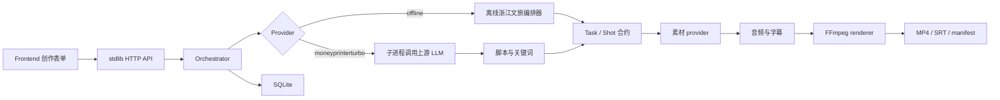

# 浙里成片项目组员交接说明

更新时间：2026-09-12

## 1. 项目定位

本项目是一个面向浙江城市文旅宣传的 AIGC 竖屏短视频生成系统，项目目录为 `zhejiang-tourism-aigc/`。

当前版本已经可以在 Windows 本地运行，完成：

```text
创作输入
→ 浙江文旅脚本与分镜
→ 离线场景素材
→ 音频与字幕
→ FFmpeg 9:16 MP4
→ 任务历史与可追溯元数据
```

项目可选调用同级的 `MoneyPrinterTurbo/`，使用其真实 LLM 脚本和素材搜索关键词生成能力。两个项目没有直接合并 Python 包，而是通过子进程隔离调用，避免两个项目都使用顶层 `app` 包导致导入冲突。

## 2. 交接范围

压缩包中包含：

- `backend/`：Python 标准库后端、领域模型、SQLite、任务编排、provider 和 FFmpeg 渲染；
- `frontend/`：无需构建工具的创作工作台；
- `tests/`：领域、存储和 MoneyPrinterTurbo 映射测试；
- `scripts/`：Windows 启动脚本和完整冒烟测试；
- `docs/`：API、架构、运维和上游适配说明；
- `.env.example`：环境配置模板；
- `README.md`：项目快速说明；
- `AI-Work-Log.md`：历史修改与验证记录；
- 本文档：组员接手和继续开发说明。

压缩包不包含：

- `runtime/` 下的数据库、日志、音频、图片和视频产物；
- `.env`、API Key 或其它本机私密配置；
- Python `__pycache__`；
- 同级 `MoneyPrinterTurbo/` 上游仓库及其 `.git` 历史。

`MoneyPrinterTurbo` 是独立上游依赖。需要真实上游脚本时，请单独准备该仓库并在本项目 `.env` 中设置 `MPT_ROOT`。

## 3. 先运行当前可验收版本

要求：

- Windows 10/11；
- Python 3.11 或更高版本；
- FFmpeg 已加入 PATH；
- PowerShell。

在项目根目录执行：

```powershell
Copy-Item .env.example .env
.\scripts\start.ps1
```

浏览器访问：

```text
http://127.0.0.1:8787
```

不启动浏览器也可以运行完整冒烟测试：

```powershell
.\scripts\smoke-test.ps1
```

冒烟测试会：

1. 使用临时端口 `8788` 启动后端；
2. 创建一个杭州 15 秒任务；
3. 轮询任务直到完成或失败；
4. 检查 `final.mp4` 是否生成；
5. 自动停止临时服务。

检查视频参数：

```powershell
ffprobe -v error -show_entries format=duration:stream=index,codec_name,codec_type,width,height -of json runtime\media\<task_id>\final.mp4
```

预期结果：

```text
duration: 15 seconds
video: 720x1280
video codec: h264
audio codec: aac
```

## 4. 安装 MoneyPrinterTurbo 依赖

当前版本已经实现上游脚本桥接，但真实上游调用需要先安装 MoneyPrinterTurbo 的依赖。

### 4.1 处理 Windows 路径

MoneyPrinterTurbo 的 Windows 文档建议项目路径不要包含中文、空格或特殊字符。目前原工作区路径包含中文目录名：

```text
C:\Users\ev041\Desktop\人工智能\
```

建议将两个项目复制到 ASCII 路径，例如：

```text
C:\work\MoneyPrinterTurbo
C:\work\zhejiang-tourism-aigc
```

不要直接删除原目录。移动或复制后，先确认新目录中的源码和工作日志完整。

### 4.2 使用 uv 安装

当前上游仓库使用 `pyproject.toml` 和 `uv.lock` 管理依赖，推荐使用锁文件安装：

```powershell
Set-Location C:\work\MoneyPrinterTurbo
uv python install 3.11
uv sync --frozen
```

如果系统中已经有满足要求的 Python，也可以直接执行：

```powershell
uv sync --frozen
```

安装完成后，项目根目录应出现：

```text
MoneyPrinterTurbo\.venv\
```

验证关键依赖：

```powershell
uv run python -c "import loguru, streamlit, fastapi, moviepy; print('dependencies OK')"
```

验证上游 LLM 服务可以导入：

```powershell
uv run python -c "from app.services import llm; print('MPT LLM service OK')"
```

旧式 pip 方式仍然可用，但不是首选：

```powershell
python -m venv .venv
.\.venv\Scripts\Activate.ps1
python -m pip install -r requirements.txt
```

### 4.3 创建并配置上游 config.toml

在 MoneyPrinterTurbo 根目录执行：

```powershell
Copy-Item config.example.toml config.toml
```

然后编辑：

```powershell
notepad config.toml
```

至少配置一个真实可用的 LLM provider。配置字段以 `config.example.toml` 和 `app/models/llm_provider.py` 为准。

例如 OpenAI 兼容接口：

```toml
llm_provider = "openai"
openai_api_key = "REPLACE_WITH_APPROVED_KEY"
openai_base_url = "https://api.openai.com/v1"
openai_model_name = "REPLACE_WITH_AVAILABLE_MODEL"
```

也可以使用仓库配置中已有的其它 provider。真实 Key 只能写入本机未提交的 `config.toml`，不能写入交接文档、Git 提交或截图。

### 4.4 配置本项目调用上游

在浙江文旅项目根目录创建 `.env`：

```powershell
Set-Location C:\work\zhejiang-tourism-aigc
Copy-Item .env.example .env
notepad .env
```

至少设置：

```dotenv
DEFAULT_PROVIDER=moneyprinterturbo
MPT_ROOT=C:\work\MoneyPrinterTurbo
MPT_PYTHON=C:\work\MoneyPrinterTurbo\.venv\Scripts\python.exe
MPT_TIMEOUT_SECONDS=180
```

如果 `MPT_ROOT` 使用默认的同级目录，可以使用：

```dotenv
MPT_ROOT=..\MoneyPrinterTurbo
MPT_PYTHON=
```

适配器会自动寻找：

```text
MoneyPrinterTurbo\.venv\Scripts\python.exe
```

## 5. 验证真实上游桥接

先单独验证 MoneyPrinterTurbo 的脚本服务：

```powershell
Set-Location C:\work\MoneyPrinterTurbo
uv run python -c "from app.services import llm; print(llm.generate_script(video_subject='杭州西湖春日城市漫游', language='Chinese', paragraph_number=4))"
```

如果上游能够打印中文脚本，再验证关键词服务：

```powershell
uv run python -c "from app.services import llm; print(llm.generate_terms(video_subject='杭州西湖春日城市漫游', video_script='清晨的西湖映着山色。', amount=4, match_script_order=True))"
```

然后运行浙江文旅项目：

```powershell
Set-Location C:\work\zhejiang-tourism-aigc
.\scripts\smoke-test.ps1
```

检查任务 trace：

```powershell
$env:PYTHONPATH = "backend"
@'
from app.config import settings
from app.storage import Storage

storage = Storage(settings.db_path)
for task in storage.list_tasks(10)[:3]:
    trace = task.get("trace") or {}
    print(task["id"], task.get("status"))
    print("provider =", trace.get("provider"))
    print("fallback_used =", trace.get("fallback_used"))
    print("events =", trace.get("events", [])[:2])
'@ | python -
```

真实上游调用成功时，预期看到：

```text
provider = moneyprinterturbo
fallback_used = False
```

如果看到：

```text
provider = offline-zhejiang-editor
fallback_used = True
```

请查看 `trace.events[0].fallback_reason`。常见原因包括：

- 上游 `.venv` 未创建；
- 上游依赖未安装；
- `config.toml` 缺少 LLM API Key；
- API Base URL 或模型名错误；
- 网络、额度或 provider 返回错误。

## 6. 当前架构和主要修改点



组员优先阅读：

| 文件 | 作用 | 修改时关注 |
| --- | --- | --- |
| `backend/app/models.py` | Task、Shot、AssetRecord、TraceRecord | 修改字段时同步存储、前端和文档 |
| `backend/app/services/orchestrator.py` | 后台任务阶段和 provider 调度 | 不要破坏阶段重试和 fallback |
| `backend/app/providers/offline.py` | 浙江 11 城市离线脚本 | 城市事实和文旅表述需要人工审核 |
| `backend/app/providers/moneyprinterturbo.py` | 上游脚本桥接和映射 | 保持子进程隔离，不要直接混用两个 `app` 包 |
| `backend/app/providers/contract.py` | 跨产线接口契约 | 改动前必须全员同步，见契约文件头部说明 |
| `backend/app/providers/media.py` | 素材 provider（离线场景图、Pexels、上传） | 素材来源和授权字段不能丢失 |
| `backend/app/providers/media_ffmpeg.py` | FFmpeg 调用、字幕 SRT、音频校验 | 转场改动容易破坏成片总时长 |
| `backend/app/providers/tts.py` | TTS provider 与兜底实现 | 需要产出 cues 才能让字幕对齐配音 |
| `backend/app/providers/music.py` | 背景音乐匹配与生成 | 当前只按目录取第一个文件，未按情绪匹配 |
| `backend/app/services/renderer.py` | FFmpeg 成片 | Windows 路径和字幕字体是高风险点 |
| `backend/app/storage.py` | SQLite 持久化 | 连接必须及时关闭，避免 Windows 文件锁 |
| `backend/app/main.py` | HTTP API 和静态文件 | 新接口需要补 API 文档和 smoke |
| `frontend/app.js` | 前端工作台和任务详情 | 修改 API 字段时同步空状态和错误状态 |
| `docs/upstream-integration.md` | 上游边界 | 记录真实调用限制和配置方式 |

## 7. 当前已完成能力

- 11 个浙江城市领域知识；
- 创作输入、脚本、标题、摘要、CTA 和标签；
- 4/6/8 分镜生成；
- 离线场景图；
- 本地素材登记和分镜绑定；
- 音频、背景音、SRT 字幕；
- 9:16 MP4 渲染；
- 任务查询、历史、阶段进度和失败重试；
- 分镜编辑后重新渲染；
- 前端视频预览、字幕下载和任务 JSON；
- AIGC 标识、素材授权字段和 trace；
- 可选 MoneyPrinterTurbo 脚本/关键词桥接；
- 无上游依赖时的离线 fallback。

## 8. 推荐的后续工作顺序

### P0：完成真实上游调用

1. 将项目放到 ASCII 路径；
2. 执行 `uv sync --frozen`；
3. 创建 `config.toml`；
4. 配置经批准的 LLM provider；
5. 直接验证 `generate_script` 和 `generate_terms`；
6. 运行真实浙江文旅任务；
7. 检查 trace、分镜、字幕和最终 MP4；
8. 修正脚本段落到镜头的映射。

### P1：提升文旅内容质量

1. 增加人工审核状态和审核意见；
2. 对景区事实、活动日期、价格、交通和荣誉信息做来源标注；
3. 增加城市、景区和非遗素材的授权有效期；
4. 接入经过审批的真实素材库；
5. 将上游关键词映射为可审阅的素材搜索请求；
6. 为 15/30/60 秒分别设计更稳定的镜头节奏；
7. 增加失败任务和 provider fallback 的前端可视化。

### P2：评估是否复用上游完整流水线

只有在 P0 和 P1 稳定后再做：

- `MaterialInfo` 到 `AssetRecord` 的完整映射；
- MoneyPrinterTurbo TTS 到当前 `audio` 合约；
- 上游字幕时间轴到当前 SRT；
- 上游 `VideoParams` 到当前 `TaskInput`；
- 远程视频生成任务状态同步；
- 远程任务 ID、超时、取消和重试；
- 版权、模型、成本和来源信息统一记录。

不要一开始直接把 MoneyPrinterTurbo 的整个 `app/` 目录复制进本项目。两个项目都使用顶层 `app` 包，直接合并会造成导入冲突和配置边界混乱。

## 9. 修改和提交规范

每次重要修改后：

1. 更新 `AI-Work-Log.md`；
2. 记录具体文件和验证命令；
3. 不提交 `.env`、`config.toml`、API Key、数据库和生成媒体；
4. 修改模型字段时同步更新 API 文档和前端；
5. 修改 provider 时保留 trace；
6. 修改 FFmpeg 时至少运行一次完整 smoke；
7. 修改 MoneyPrinterTurbo 桥接时同时运行适配器单元测试和 fallback smoke。

基础验证命令：

```powershell
python -m compileall -q backend tests
python -m unittest discover -s tests -v
node --check frontend/app.js
.\scripts\smoke-test.ps1
```

## 10. 交接完成标准

组员接手后，至少应达到以下状态：

- 能独立启动本项目并打开前端；
- 能运行默认离线 smoke 并找到生成的 MP4；
- 能解释 `Task`、`Shot`、`AssetRecord` 和 `TraceRecord`；
- 能定位脚本、素材、音频、渲染和持久化代码；
- 能安装 MoneyPrinterTurbo 依赖；
- 能识别真实上游调用失败和 fallback；
- 能在不泄露密钥的情况下配置 provider；
- 能为下一次修改补充测试和工作日志。

