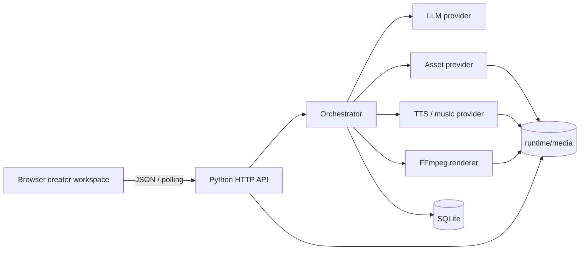
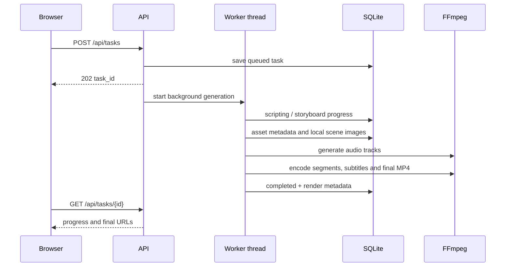

# Architecture

## Runtime topology

## Main generation flow

## Domain decisions

### Zhejiang-specific logic

城市知识库不是页面常量，而是 provider 输入的一部分。每座城市包含默认地标、别名、文化线索、颜色、事实卡片和可替换素材关键词。离线编排器依据城市、主题、节庆、受众和风格生成：

- 传播标题、摘要、CTA、标签；
- 旁白全文；
- 4/6/8 个与时长对应的分镜；
- 每个分镜的画面描述、旁白、字幕、转场；
- 事实卡片和追溯事件。

### Provider boundary

`providers/llm.py` 定义 OpenAI 兼容接口，`providers/offline.py` 提供无 Key 的结构化 fallback。

素材与音视频边界按维护职责拆成四个文件，避免多人改同一个文件：

| 文件 | 职责 |
| --- | --- |
| `providers/media.py` | 素材 provider：离线场景图、Pexels、上传 |
| `providers/media_ffmpeg.py` | FFmpeg 调用、字幕 SRT、音频校验、合成音调 |
| `providers/tts.py` | TTS 实现（类式 provider + 无凭据兜底函数） |
| `providers/music.py` | 背景音乐匹配与生成 |
| `providers/contract.py` | 跨产线接口契约（`AssetResult` / `AudioResult` / `RenderRequest`） |

外部 TTS、库存素材、文生图或视频 provider 应在这些边界内实现，不能让路由直接耦合供应商 SDK。

### Persistence

任务完整 JSON 保存在 SQLite `tasks.payload` 中，便于在不断迭代 schema 时保留历史字段；素材同时写入独立表，便于后续按照来源、授权状态、作者和任务检索。

### Failure handling

每个阶段开始和结束都会持久化状态。异常会写入 `task.error` 和 `trace.events`，任务状态变为 `failed`；前端可以显示错误并通过 retry 接口重新启动。单机版使用线程，生产环境应替换为可恢复的队列 worker。

## Security and compliance

- API Key 只从服务端环境变量读取，当前 API 不接受将密钥写入数据库。
- 静态媒体路径经过 `resolve()` 和目录边界检查，避免路径穿越。
- 输入主题、补充要求和上传 base64 均有长度限制。
- 素材记录必须包含 source、license、author、usage_scope；默认离线素材明确标记为待授权替换。
- `include_ai_label` 默认开启，生成 manifest 会记录 AIGC 说明。
